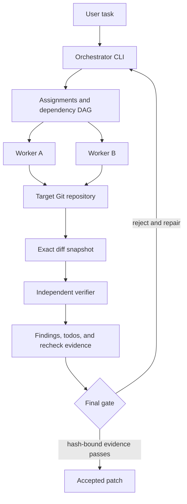

# Multiagent

Multiagent is the reference implementation of an orchestration layer for
coding agents. It is not another coding agent: it composes existing Codex and
Claude CLIs into parallel roles, records their work, independently verifies the
result, and gates acceptance on evidence bound to the exact Git diff.

The project prioritizes orchestration, evaluation, and runtime rigor over a
custom UI or model implementation.

## Requirements

The local framework requires Bash, Git, and Python 3.8 or newer. The control
plane has no third-party Python package dependency. Live agent sessions also
require `tmux` plus the configured Codex or Claude CLI.

## Try It Locally

Run the deterministic local demo from the repository root:

```bash
./scripts/demo.sh
```

It needs only Bash, Git, and Python 3.8+. It does not launch an agent, use an
API key, or spend model tokens. In under five minutes it exercises the real
repository control plane:

1. a deterministic verifier records a blocking behavior finding;
2. `gate-check` rejects the open todo;
3. a worker repair and validation result are recorded;
4. verifier acceptance is bound to the exact final-diff SHA-256;
5. the gate accepts, rejects a later stale diff, and accepts the restored
   verified diff.

See [the three-minute walkthrough](docs/demo.md) for the expected output and
the artifacts behind each transition.

## System Flow



`launch.sh` creates the tmux orchestration session. `bin/subagent.sh` manages
assignments, durable agent state, findings, repair todos, validation leases,
and the final gate. `multiagent_framework/` supplies the shared Python runtime
for exact Git snapshots, evidence validation, state publication, and coding
guardrails. SWE Bench Pro is an adapter over this production path, not a second
solver. `multiagent_framework` is not a daemon; shell commands import it or run
its short-lived CLI as needed.

## Run With Agents

Live orchestration additionally requires `tmux` and at least one configured
Codex or Claude CLI:

```bash
./launch.sh --session multiagent --root /absolute/path/to/target-repo
```

Launches are clean by default. Explicit crash recovery is opt-in:

```bash
./launch.sh --resume --session multiagent --root /absolute/path/to/target-repo
```

The default roles use Codex for orchestration and verification and Claude for
workers. `WORKER_CLI`: worker CLI for manual worker windows, default `claude`.
`VERIFIER_CLI`: verifier CLI, default `codex`. CLI choices, recovery, ownership
policy, role prompts, DAG workflows, and all control-plane commands are in the
[getting-started and operations guide](docs/getting-started.md).

## Operations Reference

The operations guide preserves the full reference for these framework
contracts and workflows:

- **Parallel DAG Discipline** and the **Structured Repair Loop**, including
  `finding-todo-loop.md`, `todo-close`, and a bounded repair worker;
- **Prompt Modules**, **Contract Scout Workflow**, `acceptance-scout.md`,
  `hidden-contract-ledger`, and hidden-contract edge cases;
- **Scope Guard Workflow**, **Validation Coordinator Workflow**, the validation lease table,
  `validation-run`, and `validation-lease-acquire`;
- **Verifier Workflow**, its compact contract ledger, and
  `MULTIAGENT_VERIFIER_MAX_ITERATIONS=3`;
- preflight checks that prevent a scaffold, shim, or proxy behavior from being
  mistaken for the target production system.

## Evaluation Framework

No-spend adapter checks are available locally:

```bash
python3 -m evaluation.cli --adapter ponytail --selftest
python3 -m evaluation.cli --adapter orchestration --selftest
```

The `orchestration` adapter covers planning behavior, dependency edges,
parallel fan-out, ownership, and final consolidation. Adapter task definitions
live under `evaluation/tasks`.

The historical production-native first-50 report records `36/50` clean
official passes. That number is a cumulative best-known aggregate from
iterative focused reruns, not a single held-out 50-row run. The exact report
snapshot, contributing run prefixes, limitations, failure analysis, and a
pinned clean-run command are in [the benchmark guide](docs/benchmark.md).
The Docker workflow uses roughly 20 GB per task container and is intentionally
an advanced path.

## Documentation

- [Three-minute local demo](docs/demo.md)
- [Getting started and operations](docs/getting-started.md)
- [Benchmark results and reproducibility](docs/benchmark.md)
- [Internal pilot request one-pager](docs/internal-pilot-request.md)
- [Evaluation framework](evaluation/README.md)

## Test

```bash
tests/run.sh
```
