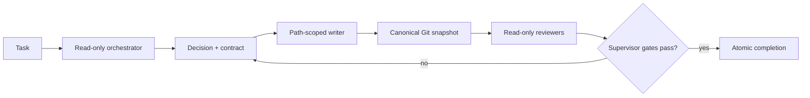

# Multiagent

Multiagent is a Rust control plane for coordinating existing coding agents. It
does not implement another coding agent or model loop. It runs Codex, Claude
Code, and Qwen Code in explicit roles, records durable workflow state, and
accepts work only when reviewer evidence matches the exact final Git diff.

## Stateful control server and client CLI

The container image runs an authenticated HTTP/WebSocket gateway as PID 1. The
repo-owned terminal client is the user and test interface; there is no browser
UI. Durable threads own public history and route work to isolated execution
sessions. Completed threads retain their public events, reports, and trace
references without requiring a live session worker.

The production container runs its authenticated control server as trusted UID 10000. A root-owned setuid launcher accepts privileged bootstrap and session launch only from that UID. The orchestrator, writer, readers, authority supervisor, and operations agent run as fixed UIDs 10001 through 10005. Only the setuid-gated `role-agent-exec` path may launch a registered role process; Landlock and Unix ownership enforce its filesystem boundary. The tmux environment is allowlisted so KMS, prod-mcp, GitHub, and AWS workload credentials remain available only to the authority supervisor and trusted control process.

Production operations are driven by authoritative Markdown runbooks rather than compiled into multiagent. The isolated operations agent materializes a generic JSON prod-mcp execution envelope from the selected `.md` runbook, and an independent read-only reviewer must bind an accepted verdict to the exact request, original goal, and runbook before the supervisor will sign it with KMS and forward it with the bearer token. The operations agent has logical authority to request any operation allowed by prod-mcp, but it never receives KMS, AWS, bearer-token, Grafana, or Kubernetes credentials. Prod-mcp remains the final operation and target policy boundary, and a separate post-execution reviewer inspects the persisted request and receipt.

Users are configured in a mounted JSON file. Passwords must be scrypt hashes, never plaintext:

```bash
node bin/hash-password.mjs operator
```

The mounted file has this shape:

```json
{
  "sessionSecret": "at-least-32-random-characters",
  "users": [
    {"username": "operator", "passwordHash": "scrypt$16384$8$1$..."}
  ]
}
```

Thread repositories must be provisioned as Git worktrees below `MULTIAGENT_REPOSITORY_ROOT`. Repository provisioning is owned by the deployment rather than the control server, so restarting the gateway never fetches or mutates source checkouts.

Important container variables:

- `MULTIAGENT_USERS_FILE`: mounted login configuration, default `/run/secrets/multiagent/users.json`.
- `MULTIAGENT_REPOSITORY_ROOT`: deployment-provisioned Git worktrees available for new tasks.
- `MULTIAGENT_IDLE_TIMEOUT_SECONDS`: inactivity period after which a running task is checkpointed and paused.
- `MULTIAGENT_PUBLIC_URL`: canonical HTTPS origin accepted for WebSocket and same-origin requests.
- `PROD_MCP_URL`: internal MCP endpoint used only by the authority supervisor.
- `MULTIAGENT_KMS_KEY_ID`: AWS KMS P-256 key alias or ARN used only by the authority supervisor.

The PVC mounted at `/var/lib/multiagent` is the primary store for repositories, CLI conversation history, checkpoints, and session metadata. Final reports, a bounded terminal tail, and the transcript index live under each task's existing `logs` trace root. They reference immutable agent event traces instead of duplicating full transcripts. Deployment infrastructure may export this state to durable storage without coupling the control server to a storage provider.

### Client CLI

The client uses the public thread API directly. With no command it opens a
persistent, Claude Code-style terminal for listing, selecting, creating, and
continuing threads. Its explicit subcommands output JSON for agents, scripts,
and debugging. Login stores only the scoped session cookie in a local file with
mode `0600`; the password is read from a hidden prompt or stdin and is never
accepted as a command-line option.

```bash
cd control-server
npm run client -- --server https://agent.example login operator
npm run client --

# Non-interactive examples
npm run client -- threads list
npm run client -- repositories list
npm run client -- threads create incident-123 \
  --repository multiagent \
  --message "Investigate the current incident"
npm run client -- threads show incident-123
npm run client -- threads watch incident-123
npm run client -- threads send incident-123 --message "Check the latest logs"
```

Use `sessions list THREAD_ID` for execution details and `legacy list` or
`legacy report SESSION_ID` only for pre-thread compatibility records. Set
`MULTIAGENT_SERVER` and `MULTIAGENT_CLIENT_SESSION_FILE` to avoid repeating the
global options. Plain HTTP is rejected except for localhost development.

## Requirements

From a source checkout you need Rust 1.98+, Cargo, Bash, Git, and tmux. Install
and authenticate at least one supported coding-agent CLI. Python 3.8+ is used
only by evaluation and evidence-analysis tools, not the production control
plane.

## Quick Start

Run:

```bash
./launch.sh --session multiagent --root /absolute/path/to/target-repo
```

`launch.sh` is only a compatibility bootstrap. It locates or builds the Rust
binary and immediately executes:

```bash
multiagent launch --session multiagent --root /absolute/path/to/target-repo
```

Launches are clean by default. Resume durable state after an interrupted run
with:

```bash
./launch.sh --resume --session multiagent --root /absolute/path/to/target-repo
```

The default role backends are Codex for orchestration and verification and
Claude Code for workers. To use one backend for every role:

```bash
ORCHESTRATOR_CLI=codex \
WORKER_CLI=codex \
SUBAGENT_CLI=codex \
VERIFIER_CLI=codex \
./launch.sh --root /absolute/path/to/target-repo
```

Supported backend names are `codex`, `claude`, and `qwen`.

## What Runs



The Rust binary owns decisions, workflow phases, assignments, snapshots,
findings, todos, reviewer evidence, process lifecycle, status, and recovery.
Tmux owns PTYs and interactive terminal lifecycle. Python is restricted to
evaluation and provenance; it does not implement a second production workflow
or acceptance gate.

On production Linux, separate Unix identities isolate the orchestrator, the
single active writer, read-only agents, and the authority supervisor. The
orchestrator can read worker and reviewer state but cannot write the target
repository or protected lifecycle state. Completion is a request to the
supervisor, which checks every gate under the lifecycle lock before changing
the phase to `complete`.

## Common Commands

```bash
multiagent status
multiagent watch
multiagent decision list
multiagent workflow status "$MULTIAGENT_WORKFLOW_ID"
multiagent subagent list
multiagent subagent gate-check
multiagent orchestrator complete
```

Normally the orchestrator issues lifecycle and subagent commands. Operators use
the status, watch, recovery, and inspection commands to supervise a run.

## Documentation

- [Decisions](docs/decisions.md) — why the control plane and backend boundary
  have this shape.
- [Architecture](docs/architecture.md) — components, authority boundaries,
  lifecycle, state, and evaluation boundary.
- [Getting started and operations](docs/getting-started.md) — configuration,
  normal operation, decisions, agents, recovery, traces, and troubleshooting.

## Test

```bash
cargo test
bash tests/run.sh
```

Linux authority-boundary coverage is exercised by:

```bash
bash tests/malicious-orchestrator.sh
```
