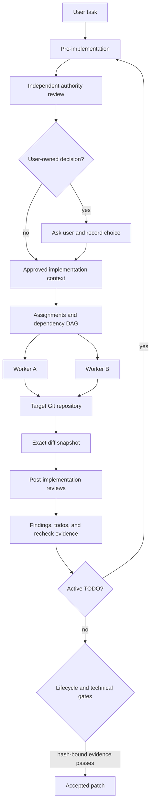

# Multiagent

Multiagent is the reference implementation of an orchestration layer for
coding agents. It is not another coding agent: it composes existing Codex and
Claude CLIs into parallel roles, records their work, independently verifies the
result, and gates acceptance on evidence bound to the exact Git diff.

The project prioritizes orchestration, evaluation, and runtime rigor over a
custom UI or model implementation.

## Requirements

Building from source requires Rust 1.75 or newer, Cargo, Bash, Git, and Python 3.8 or newer.
Rust owns the production control-plane state machine. Python is
retained for evaluation adapters and a small number of compatibility evidence
audits during the migration and has no third-party Python package dependency.
Live agent sessions also require `tmux` plus the
configured Codex or Claude CLI.

## Try It Locally

Run the deterministic local demo from the repository root:

```bash
./scripts/demo.sh
```

It needs Rust/Cargo, Bash, Git, and Python 3.8+. It does not launch an agent, use an
API key, or spend model tokens. In under five minutes it exercises the real
repository control plane:

1. a deterministic verifier records a blocking behavior finding;
2. `gate-check` rejects the open todo;
3. a worker repair and validation result are recorded;
4. verifier acceptance is bound to the exact final-diff SHA-256;
5. the gate accepts, rejects a later stale diff, and accepts the restored
   verified diff.

See [the three-minute walkthrough](docs/demo.md) for the expected output and
the artifacts behind each transition.

## System Flow



`bin/multiagent` is the unified CLI. Its Rust core owns exact Git snapshots,
decisions, DAGs, lifecycle transitions, assignments, findings, repair todos,
validation leases, and validation subprocesses. `launch.sh`, `status.sh`, and
the tmux portions of `subagent.sh` remain external runtime adapters; the Rust
CLI can dispatch them without owning a PTY. `multiagent_framework/` remains the
Python evaluation and compatibility client. SWE Bench Pro is an adapter over
the production path, not a second solver. `multiagent_framework` is not a daemon;
it is imported by evaluation processes as needed. See
[the control-plane boundary](docs/control-plane-boundary.md).

## Run With Agents

Live orchestration additionally requires `tmux` and at least one configured
Codex or Claude CLI:

```bash
./launch.sh --session multiagent --root /absolute/path/to/target-repo
```

Launches are clean by default. Explicit crash recovery is opt-in:

```bash
./launch.sh --resume --session multiagent --root /absolute/path/to/target-repo
```

## Implementation Lifecycle

`launch.sh` bundles the orchestrator role with the mandatory lifecycle prompt,
records prompt hashes, and initializes durable lifecycle state under:

```text
$MULTIAGENT_STATE_DIR/workflows/$MULTIAGENT_WORKFLOW_ID/lifecycle/
```

`bin/workflow.sh` is a compatibility entry point for the Rust lifecycle state
machine in `src/workflow.rs`. Existing v1 state files remain readable. Set
`MULTIAGENT_USE_LEGACY_WORKFLOW=1` only for migration diagnosis.

The enforced normal path is `pre-implementation -> implementation ->
post-implementation`. An independent authority review identifies consequential
choices and whether the user or orchestrator owns each one. Writable workers
receive the complete approved implementation context, not only a partial
assignment summary. Any accepted review finding creates a TODO and returns through
pre-implementation before another edit iteration.
The implementation permit also verifies that `bin/decision.sh` contains a
committed decision whose selected plan matches the context and assignment.

Inspect and advance the state with:

```bash
bin/workflow.sh status "$MULTIAGENT_WORKFLOW_ID"
bin/workflow.sh prepare-implementation "$MULTIAGENT_WORKFLOW_ID" \
  --decision-id DECISION_ID --plan-id PLAN_ID --decision-revision REVISION \
  --implementation-context CONTEXT_PATH --authority-review REVIEW_ID
bin/workflow.sh transition "$MULTIAGENT_WORKFLOW_ID" implementation
bin/workflow.sh completion-check "$MULTIAGENT_WORKFLOW_ID"
```

`MULTIAGENT_LIFECYCLE_ENFORCEMENT=1` is the default. Existing structured
technical findings and repair TODOs remain authoritative. Running
`bin/orchestrator.sh complete` requires both the lifecycle completion gate and
`bin/subagent.sh gate-check`.

The default roles use Codex for orchestration and verification and Claude for
workers. `WORKER_CLI`: worker CLI for manual worker windows, default `claude`.
`VERIFIER_CLI`: verifier CLI, default `codex`. CLI choices, recovery, ownership
policy, role prompts, DAG workflows, and all control-plane commands are in the
[getting-started and operations guide](docs/getting-started.md).

## Operations Reference

The operations guide preserves the full reference for these framework
contracts and workflows:

- **Parallel DAG Discipline** and the **Structured Repair Loop**, including
  `finding-todo-loop.md`, `todo-close`, and a bounded repair worker;
- **Prompt Modules**, **Contract Scout Workflow**, `acceptance-scout.md`,
  `hidden-contract-ledger`, and hidden-contract edge cases;
- **Scope Guard Workflow**, **Validation Coordinator Workflow**, the validation lease table,
  `validation-run`, and `validation-lease-acquire`;
- **Verifier Workflow**, its compact contract ledger, and the
  `MULTIAGENT_VERIFIER_MAX_ITERATIONS=3` escalation threshold;
- Codex UI dashboard watching through `bin/watch.sh`, backed by tmux pane logs
  under `.multiagent/logs`, blocked-agent state, and workflow DAG nodes;
- preflight checks that prevent a scaffold, shim, or proxy behavior from being
  mistaken for the target production system.

## Evaluation Framework

No-spend adapter checks are available locally:

```bash
python3 -m evaluation.cli --adapter ponytail --selftest
python3 -m evaluation.cli --adapter orchestration --selftest
```

The `orchestration` adapter covers planning behavior, dependency edges,
parallel fan-out, ownership, and final consolidation. Adapter task definitions
live under `evaluation/tasks`.

The historical production-native first-50 report records `36/50` clean
official passes. That number is a cumulative best-known aggregate from
iterative focused reruns, not a single held-out 50-row run. The exact report
snapshot, contributing run prefixes, limitations, failure analysis, and a
pinned clean-run command are in [the benchmark guide](docs/benchmark.md).
The Docker workflow uses roughly 20 GB per task container and is intentionally
an advanced path.

## Documentation

- [Three-minute local demo](docs/demo.md)
- [Getting started and operations](docs/getting-started.md)
- [Benchmark results and reproducibility](docs/benchmark.md)
- [Internal pilot request one-pager](docs/internal-pilot-request.md)
- [Evaluation framework](evaluation/README.md)

## Test

```bash
tests/run.sh
```

## Enforcement Caveat

Decision-authority review, approved-context handoff, lifecycle TODO convergence,
and completion are enforced by the orchestrator prompt plus normal-path checks
in `bin/workflow.sh`, `bin/subagent.sh`, and `bin/orchestrator.sh`. This makes
ordinary violations fail visibly, but it is not a security or capability
boundary: an orchestrator with direct shell and state-file access can bypass or
disable these checks.

Revisit this limitation before treating the workflow as strict enforcement.
The stronger design is a trusted supervisor that exclusively owns writable
worker launch and independently validates TODO state, decision ownership, user
approval, context revision, and assignment scope before starting a worker.
