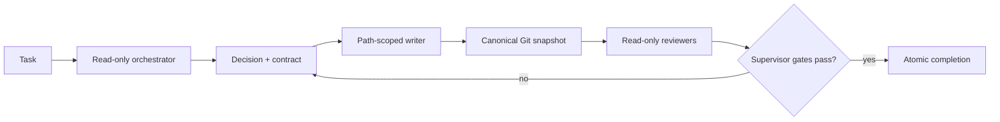

# Multiagent

Multiagent is a Rust control plane for coordinating existing coding agents. It
does not implement another coding agent or model loop. It runs Codex, Claude
Code, and Qwen Code in explicit roles, records durable workflow state, and
accepts work only when reviewer evidence matches the exact final Git diff.

## Requirements

From a source checkout you need Rust 1.75+, Cargo, Bash, Git, and tmux. Install
and authenticate at least one supported coding-agent CLI. Python 3.8+ is used
only by evaluation and evidence-analysis tools, not the production control
plane.

## Quick Start

Run:

```bash
./launch.sh --session multiagent --root /absolute/path/to/target-repo
```

`launch.sh` is only a compatibility bootstrap. It locates or builds the Rust
binary and immediately executes:

```bash
multiagent launch --session multiagent --root /absolute/path/to/target-repo
```

Launches are clean by default. Resume durable state after an interrupted run
with:

```bash
./launch.sh --resume --session multiagent --root /absolute/path/to/target-repo
```

The default role backends are Codex for orchestration and verification and
Claude Code for workers. To use one backend for every role:

```bash
ORCHESTRATOR_CLI=codex \
WORKER_CLI=codex \
SUBAGENT_CLI=codex \
VERIFIER_CLI=codex \
./launch.sh --root /absolute/path/to/target-repo
```

Supported backend names are `codex`, `claude`, and `qwen`.

## What Runs



The Rust binary owns decisions, workflow phases, assignments, snapshots,
findings, todos, reviewer evidence, process lifecycle, status, and recovery.
Tmux owns PTYs and interactive terminal lifecycle. Python is restricted to
evaluation and provenance; it does not implement a second production workflow
or acceptance gate.

Production operations use a separate enforcement boundary. Ephemeral runbook
agents carry certified runbooks through manifest preparation, review, execution
request, and receipt verification. The OS-isolated supervisor binds roles and
tasks, signs short-lived permits through KMS or Vault, and submits them to
`prod-mcp`, which performs the side effect. Agents and the orchestrator never
receive production credentials or signing keys. See
[Production operations](docs/production-operations.md).

On production Linux, separate Unix identities isolate the orchestrator, the
single active writer, read-only agents, and the authority supervisor. The
orchestrator can read worker and reviewer state but cannot write the target
repository or protected lifecycle state. Completion is a request to the
supervisor, which checks every gate under the lifecycle lock before changing
the phase to `complete`.

## Common Commands

```bash
multiagent status
multiagent watch
multiagent decision list
multiagent workflow status "$MULTIAGENT_WORKFLOW_ID"
multiagent subagent list
multiagent subagent gate-check
multiagent orchestrator complete
```

Normally the orchestrator issues lifecycle and subagent commands. Operators use
the status, watch, recovery, and inspection commands to supervise a run.

## Documentation

- [Decisions](docs/decisions.md) — why the control plane and backend boundary
  have this shape.
- [Architecture](docs/architecture.md) — components, authority boundaries,
  lifecycle, state, and evaluation boundary.
- [Getting started and operations](docs/getting-started.md) — configuration,
  normal operation, decisions, agents, recovery, traces, and troubleshooting.
- [Production operations](docs/production-operations.md) — fixed runbook agents,
  supervisor role binding, signing backends, and MCP submission.

## Test

```bash
cargo test
bash tests/run.sh
```

Linux authority-boundary coverage is exercised by:

```bash
bash tests/malicious-orchestrator.sh
```
