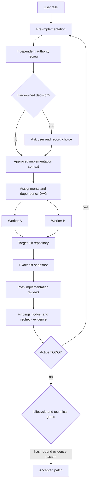

# Multiagent

Multiagent is the reference implementation of an orchestration layer for
coding agents. It is not another coding agent: it composes existing Codex,
Claude Code, and Qwen Code agents into parallel roles, records their work,
independently verifies the result, and gates acceptance on evidence bound to the
exact Git diff.

The project prioritizes orchestration, evaluation, and runtime rigor over a
custom UI or model implementation.

## Requirements

Building from source requires Rust 1.75 or newer, Cargo, Bash, and Git. Rust owns
the production control plane. Python 3.8 or newer is required only for evaluation
and evidence-analysis commands; those modules have no third-party Python package
dependency. Live agent sessions also require `tmux` plus the configured coding-agent
executables.

## Try It Locally

Run the deterministic local demo from the repository root:

```bash
./scripts/demo.sh
```

It needs Rust/Cargo, Bash, and Git. It does not launch an agent, use an
API key, or spend model tokens. In under five minutes it exercises the real
repository control plane:

1. a deterministic verifier records a blocking behavior finding;
2. `gate-check` rejects the open todo;
3. a worker repair and validation result are recorded;
4. verifier acceptance is bound to the exact final-diff SHA-256;
5. the gate accepts, rejects a later stale diff, and accepts the restored
   verified diff.

See [the three-minute walkthrough](docs/demo.md) for the expected output and
the artifacts behind each transition.

## System Flow



`multiagent` is the unified CLI. Its Rust core owns exact Git snapshots,
decisions, DAGs, lifecycle transitions, assignments, findings, repair todos,
validation leases, validation subprocesses, tmux process orchestration, status,
watching, and recovery. `launch.sh` is the source-checkout bootstrap: it locates
or builds the Rust executable and immediately runs `multiagent launch`. tmux—not
shell or Rust—continues to own the PTY. Python under `evaluation/` is limited to
benchmark execution, status reading, and provenance. The SWE Bench Pro adapter
drives the production Rust path and transports its workspace diff to the
official scorer; it does not implement a second solver or acceptance gate. See
[the control-plane boundary](docs/control-plane-boundary.md).

## Run With Agents

Live orchestration additionally requires `tmux` and the coding-agent executables
selected for its roles:

```bash
./launch.sh --session multiagent --root /absolute/path/to/target-repo
```

Launches are clean by default. Explicit crash recovery is opt-in:

```bash
./launch.sh --resume --session multiagent --root /absolute/path/to/target-repo
```

## Implementation Lifecycle

`multiagent launch` bundles the orchestrator role with the mandatory lifecycle
prompt, records prompt hashes, and initializes durable lifecycle state under:

```text
$MULTIAGENT_STATE_DIR/workflows/$MULTIAGENT_WORKFLOW_ID/lifecycle/
```

`multiagent workflow` is the Rust lifecycle state machine in `src/workflow.rs`.
Existing v1 state files remain readable.

The enforced normal path is `pre-implementation -> implementation ->
post-implementation`. An independent authority review identifies consequential
choices and whether the user or orchestrator owns each one. Writable workers
receive the complete approved implementation context, not only a partial
assignment summary. Any accepted review finding creates a TODO and returns through
pre-implementation before another edit iteration.
The implementation permit also verifies that `multiagent decision` contains a
committed decision whose selected plan matches the context and assignment.

Inspect and advance the state with:

```bash
multiagent workflow status "$MULTIAGENT_WORKFLOW_ID"
multiagent workflow prepare-implementation "$MULTIAGENT_WORKFLOW_ID" \
  --decision-id DECISION_ID --plan-id PLAN_ID --decision-revision REVISION \
  --implementation-context CONTEXT_PATH --authority-review REVIEW_ID
multiagent workflow transition "$MULTIAGENT_WORKFLOW_ID" implementation
multiagent workflow completion-check "$MULTIAGENT_WORKFLOW_ID"
```

`MULTIAGENT_LIFECYCLE_ENFORCEMENT=1` is the default. Existing structured
technical findings and repair TODOs remain authoritative. Running
`multiagent orchestrator complete` requires both the lifecycle completion gate and
`multiagent subagent gate-check`.

The default roles use Codex for orchestration and verification and Claude for
workers. `WORKER_CLI`: worker coding-agent backend for manual worker windows,
default `claude`; supported values are `codex`, `claude`, and `qwen`.
`VERIFIER_CLI`: verifier backend, default `codex`. Backend choices, recovery, ownership
policy, role prompts, DAG workflows, and all control-plane commands are in the
[getting-started and operations guide](docs/getting-started.md).

## Operations Reference

The operations guide preserves the full reference for these framework
contracts and workflows:

- **Parallel DAG Discipline** and the **Structured Repair Loop**, including
  `finding-todo-loop.md`, `todo-close`, and a bounded repair worker;
- **Prompt Modules**, **Contract Scout Workflow**, `acceptance-scout.md`,
  `hidden-contract-ledger`, and hidden-contract edge cases;
- **Scope Guard Workflow**, **Validation Coordinator Workflow**, the validation lease table,
  `validation-run`, and `validation-lease-acquire`;
- **Verifier Workflow**, its compact contract ledger, and the
  `MULTIAGENT_VERIFIER_MAX_ITERATIONS=3` escalation threshold;
- Codex UI dashboard watching through `multiagent watch`, backed by tmux pane logs
  under `.multiagent/logs`, blocked-agent state, and workflow DAG nodes;
- preflight checks that prevent a scaffold, shim, or proxy behavior from being
  mistaken for the target production system.

## Evaluation Framework

No-spend adapter checks are available locally:

```bash
python3 -m evaluation.cli --adapter ponytail --selftest
python3 -m evaluation.cli --adapter orchestration --selftest
```

The `orchestration` adapter covers planning behavior, dependency edges,
parallel fan-out, ownership, and final consolidation. Adapter task definitions
live under `evaluation/tasks`.

The historical production-native first-50 report records `36/50` clean
official passes. That number is a cumulative best-known aggregate from
iterative focused reruns, not a single held-out 50-row run. The exact report
snapshot, contributing run prefixes, limitations, failure analysis, and a
pinned clean-run command are in [the benchmark guide](docs/benchmark.md).
The Docker workflow uses roughly 20 GB per task container and is intentionally
an advanced path.

## Documentation

- [Three-minute local demo](docs/demo.md)
- [Getting started and operations](docs/getting-started.md)
- [Benchmark results and reproducibility](docs/benchmark.md)
- [Internal pilot request one-pager](docs/internal-pilot-request.md)
- [Evaluation framework](evaluation/README.md)

## Test

```bash
tests/run.sh
```

## Enforcement Boundary

Production Linux launches separate the orchestrator, writer, reader, and
authority supervisor into distinct Unix identities. The supervisor exclusively
owns workflow state, one-time role launch authorizations, and sealed reviewer
evidence. The orchestrator can request transitions and spawn named roles, but it
cannot write the target repository or authority state directly. A writer gets
temporary ownership only of its predeclared paths, and only one writer may be
active at a time. Read-only roles cannot acquire those writes.

This is a capability boundary for filesystem writes and typed state changes,
not proof that an agent's semantic judgment is correct. Reviewer evidence proves
which isolated process produced a verdict and which workflow/diff it covered;
task correctness still depends on the reviewer, tests, and final human review.
