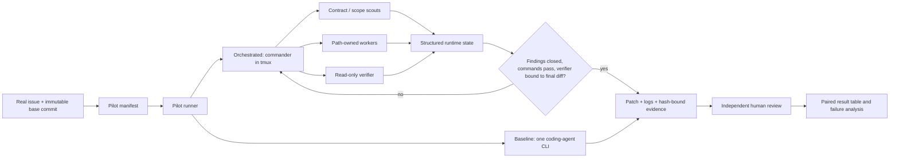

# Architecture

Multiagent is an orchestration and evidence layer around existing coding-agent
CLIs. It is not a replacement model or a claim that every task benefits from
parallelism.

## Runtime Boundary

`launch.sh` execs the Rust `multiagent launch` command. Rust validates and
exports the target root, state directory, prompt modules, CLI choices, write
policy, and verifier iteration cap before starting the orchestrator. The
orchestrator delegates through `multiagent subagent`; assignments,
checkpoints, findings, todos, validation leases, and verifier evidence are
persisted under `MULTIAGENT_STATE_DIR`. Python under `evaluation/` provides
benchmark execution, status reading, and provenance; it does not implement a
second control plane or participate in normal launches.

Workers own disjoint writable paths. Scouts and verifiers are read-only. The
orchestrator alone accepts follow-up work and decides whether the final gate can
close. Hash-bound verifier evidence becomes stale when the final diff changes.

## Evaluation Boundary

The built-in adapters exercise deterministic safety/minimalism tasks and
synthetic orchestration plans. Their reference fixtures prove scorer polarity,
not production reliability. SWE Bench Pro drives the production solver inside
task containers and delegates official scoring to the benchmark parser.

The internal pilot sits outside both paths. It clones each real target commit
into isolated baseline and orchestrated cells, invokes a driver through a small
environment contract, runs the same preflight and validation commands, hashes
the resulting patch, and waits for independent human acceptance. This keeps
target selection and organizational adoption outside the framework: a human
team must still volunteer tasks, grant access, and review outcomes.

## Trust Boundaries

- Task owners supply issue text, an immutable reachable commit, reproduction
  commands, validation commands, and acceptance criteria.
- Agent CLIs may edit only the isolated target clone. Their exit code is not an
  acceptance verdict.
- The pilot runner records evidence but does not infer semantic correctness.
- Independent reviewers decide correctness, regression risk, and scope.
- Report authors disclose dirty harnesses, exclusions, reruns, missing logs,
  model/CLI versions, and costs.
