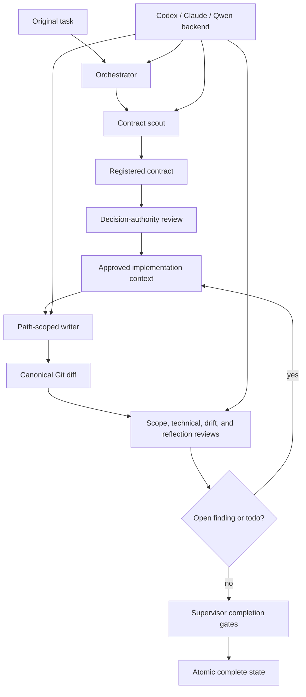

# Architecture

Multiagent is a Rust orchestration and evidence layer around existing
coding-agent CLIs. Its architecture separates three concerns:

1. coding agents propose, implement, or review work;
2. the Rust control plane records and coordinates that work;
3. an authority supervisor enforces who may write and when a workflow may
   advance.

The rationale for these boundaries is recorded in [Decisions](decisions.md).
Operational commands are in [Getting started and operations](getting-started.md).

## System Overview



## Components

### Rust CLI and Control Plane

`multiagent` is the only production command surface. Its modules own:

- launch configuration and tmux subprocess orchestration;
- coding-agent backend selection and process supervision;
- decision records and DAG metadata;
- implementation lifecycle transitions;
- assignments, checkpoints, findings, todos, and validation leases;
- canonical tracked, staged, unstaged, and untracked Git snapshots;
- hash-bound reviewer evidence;
- status, watching, cancellation, and recovery.

`launch.sh` contains no workflow logic. It locates or builds the Rust executable
and execs `multiagent launch` so existing source-checkout callers remain
compatible.

The production control server has two deployment modes. A persistent gateway
creates one bounded Kubernetes Job per authenticated session from a
deployment-owned template. The Job runs a session worker that invokes the same
`launch.sh --session ID --root PATH --no-attach` interface and remains alive to
serve terminal, status, and completion traffic. The Rust session runtime does
not call Kubernetes APIs; only the gateway receives session-Job RBAC.

### Tmux

Tmux owns the PTY, session, window, and interactive terminal lifecycle. Rust
creates and observes tmux processes but does not allocate or emulate a PTY.
Pane output is copied to durable logs for status and recovery.

### Coding-Agent Backends

The static backend registry maps:

```text
codex  -> Codex CLI
claude -> Claude Code
qwen   -> Qwen Code
```

Every backend produces an argv-based process specification and accepts a
working directory, prompt bytes, access mode, final-output path, trace path, and
optional native resume identifier. The shared runner owns timeouts,
cancellation, process groups, raw logs, normalized events, and final-result
selection.

Provider capabilities are explicit. Native resume or structured events may be
used only when the backend declares support. Provider approval-bypass flags do
not add filesystem authority; the outer role boundary remains authoritative.

### Authority Supervisor

Production Linux runs four process identities:

| Identity | May read target | May write target | Protected-state authority |
| --- | --- | --- | --- |
| Orchestrator | yes | no | typed requests only |
| Writer | yes | assigned paths while leased | no |
| Scout/reviewer | yes | no | sealed evidence only |
| Supervisor | metadata needed for gates | grants/revokes writer paths | yes |

The supervisor owns the Unix socket and protected workflow, assignment,
finding/todo, launch-authorization, writer-lease, and evidence directories. Peer
credentials identify the caller. Selecting a different state path does not
replace the root-registered authority socket.

The privileged `role-agent-exec` path accepts only a persisted named headless
agent launch. It validates the root-owned backend executable, role, prompt,
workflow, and owned paths before dropping to the role UID. Every other command
drops privilege. Landlock narrows access when supported; Unix ownership remains
the tested base boundary. Cancellation waits for role teardown and ownership
revocation, preventing detached or late worker output from modifying the
workspace.

The supervisor isolates connection failures. A disconnected client or broken
pipe terminates that request, not the authority service.

## Lifecycle

The normal state sequence is:

```text
pre-implementation -> implementation -> post-implementation -> complete
```

### Pre-implementation

1. The original task is stored immutably and hashed.
2. A read-only contract scout emits structured `must` and `must-not` rules.
3. The supervisor seals and registers the scout artifact.
4. A decision record selects a plan.
5. An independent authority reviewer receives the original task, exact contract,
   and implementation context.
6. The writer gate opens only when the decision, plan, context, authority review,
   and contract hashes agree.

### Implementation

The supervisor authorizes one writer for predeclared paths. The writer receives
the complete approved context and registered contract. Assignment checks reject
changed files outside the declared scope. Read-only exploration can still run
in parallel.

### Post-implementation

The control plane computes one canonical diff hash. Scope, technical,
decision-drift, and reflection reviewers receive:

- the immutable original task;
- the exact registered contract artifact;
- the approved implementation context;
- the live canonical diff.

Findings become durable todos. A changed diff makes prior acceptance stale.
Unresolved work returns the lifecycle to a new pre-implementation iteration.

### Completion

The orchestrator cannot transition directly to `complete`. It calls:

```bash
multiagent orchestrator complete
```

The supervisor acquires the lifecycle lock, checks required reviews, exact diff
binding, closed findings/todos, assignment state, and technical gates, and only
then writes `phase=complete`. Failure leaves the prior phase unchanged.

## Durable State

By default state lives at `$MULTIAGENT_ROOT/.multiagent`:

```text
.multiagent/
  assignments/             assignment ownership and checkpoints
  decisions/               alternatives, selected plans, metrics, reflection
  findings/                structured verifier findings
  logs/                    orchestrator, role, and watcher logs
    agents/                immutable per-attempt raw and normalized traces
  subagents/               role status, metadata, transcript, final message
  workflows/               DAG and implementation lifecycle state
  worktrees/               optional worker worktrees and metadata
```

Supervisor-owned deployments place protected subsets under authority-owned
paths with stricter permissions. State files remain intentionally simple and
inspectable; locks and atomic replacement protect updates.

## Trace Model

Each backend attempt records:

- backend identity and version;
- workflow, role, assignment, and process correlation data;
- raw stdout and stderr;
- normalized JSONL events when decoding is available;
- provider session identity when available;
- final message and exit, timeout, signal, or cancellation reason.

Attempts are immutable (`attempt-NNNN`); `latest` identifies the newest attempt.
Evaluation can mount the trace root outside a task container so teardown does
not destroy evidence.

## Evaluation Boundary

Python under `evaluation/` is outside the production control plane. An adapter
may prepare an image, inject the public task, launch the same Rust workflow, and
export the workspace diff and trace. It then gives that diff to the official
benchmark runner.

The adapter does not:

- implement a fallback solver;
- reinterpret agent completion;
- inspect hidden expected-test metadata for the solver;
- duplicate official scoring;
- mutate protected workflow state.

This separation ensures an evaluation measures the production solver rather
than an eval-side scaffold.

## Guarantees and Non-Guarantees

The architecture guarantees process identity, access mode, owned-path scope,
state-transition authority, evidence integrity, and diff binding when deployed
with the Linux role boundary.

It does not guarantee that a scout found every implicit contract, that a
reviewer made the right semantic judgment, that tests are sufficient, or that a
coding agent produced the best solution. Those remain evidence-quality and
human-review concerns.
