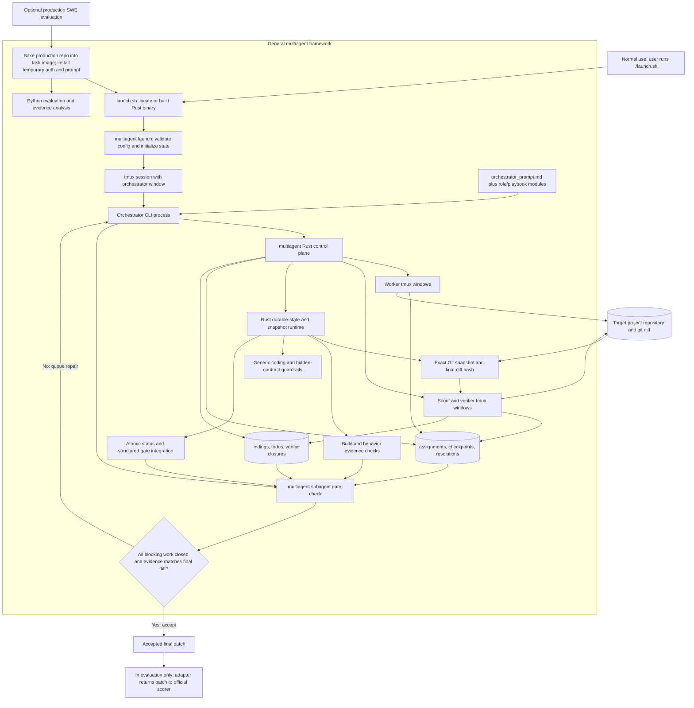

# Getting Started And Operations

This guide preserves the detailed operational reference that previously lived
in the project README. Start with the [local no-spend demo](demo.md) for a
short proof of the orchestration gate. SWE Bench Pro setup and result provenance
live in the separate [benchmark guide](benchmark.md).

This project launches a tmux session with one `orchestrator` window. The orchestrator prompt coordinates worker agents and named long-running subagents.

## Features

- **Tmux Integration**: Seamless session management with configurable session names
- **Long-Running Subagents**: Persistent agents that maintain state across interactions
- **Flexible Configuration**: Environment-based setup for different project contexts
- **State Persistence**: Durable subagent state management with transcript logging
- **Assignment Checks**: Repo-local metadata and post-work acceptance checks for branch and file ownership
- **Structured Repair Loop**: Verifier findings become queued todos, workers attach resolution evidence, and final gates require hash-bound verifier closure
- **Parallel DAG Discipline**: Ready workers with disjoint ownership fan out in parallel and consolidate later

## Requirements

- `tmux`
- Rust 1.75 or newer and Cargo when running from a source checkout
- Python 3.8 or newer only for evaluation and evidence-analysis commands; no `pip install` or virtual environment is required
- Codex CLI or Claude CLI, according to the configured orchestrator and agent roles

`launch.sh` locates or builds the Rust binary and execs `multiagent launch`,
which checks runtime prerequisites before creating the tmux session. Durable
production state and exact Git snapshot binding run entirely in Rust.

## Launch

```bash
./launch.sh --session multiagent --root /Users/bowu/projects/multiagent
```

Launches are clean by default. The orchestrator receives
`MULTIAGENT_RESUME=0`, lists the current session/windows/subagents, and waits
for direction without inspecting recovery state.

To explicitly resume after a previous crashed or interrupted session:

```bash
./launch.sh --resume --session multiagent --root /Users/bowu/projects/multiagent
```

With `--resume`, the orchestrator receives `MULTIAGENT_RESUME=1` and should run
`multiagent subagent recover-plan` before deciding whether to restore persisted
subagents.

Environment:

- `MULTIAGENT_SESSION`: tmux session name, default `multiagent`
- `MULTIAGENT_ROOT`: project root, default launcher directory
- `MULTIAGENT_RESUME`: launch mode exported by `multiagent launch`; `0` clean launch, `1` explicit `--resume`
- `MULTIAGENT_STATE_DIR`: durable subagent state, default `$MULTIAGENT_ROOT/.multiagent`
- `MULTIAGENT_WRITE_POLICY`: repo write policy, default `$MULTIAGENT_ROOT/docs/write-policy.paths`
- `MULTIAGENT_VERIFIER_MAX_ITERATIONS`: worker/verifier follow-up loop cap, default `3`
- `MULTIAGENT_PROMPT`: orchestrator prompt, default `<launcher directory>/orchestrator_prompt.md`
- `ORCHESTRATOR_CLI`: orchestrator CLI, default `codex`
- `WORKER_CLI`: worker CLI for manual worker windows, default `claude`
- `SUBAGENT_CLI`: named subagent CLI, default `$WORKER_CLI`
- `VERIFIER_CLI`: verifier CLI, default `codex`
- `CODEX_BIN`: Codex CLI command, default `codex`
- `CLAUDE_BIN`: Claude CLI command, default `claude`

The default setup keeps the orchestrator on Codex, uses Claude for workers and
generic named subagents, and uses Codex for verifier agents. To use Codex for
workers and generic named subagents too:

```bash
ORCHESTRATOR_CLI=codex WORKER_CLI=codex SUBAGENT_CLI=codex ./launch.sh
```

The Rust supervisor assigns Codex access from trusted process roles. On hosts
where Codex's native sandbox is available, the orchestrator starts in the
durable state directory with `workspace-write`, workers start in the target
repository with `workspace-write`, and scouts/authority reviewers use
`read-only`. The production Linux-container adapter uses separate unprivileged
Unix identities instead because nested bubblewrap is unavailable under Docker's
default seccomp profile. Its tmux server runs as the non-writing orchestrator
identity. A narrowly gated, setuid Rust entrypoint may only start the fixed
Codex subagent command recorded for a named role; all other invocations
permanently drop back to the caller UID. Each role also receives a private
Codex runtime home so one role's private lock/config files cannot stall another.
The isolated orchestrator's real UID makes lifecycle enforcement mandatory, so
shell-level environment overrides cannot authorize a writer after completion.
In both environments the orchestrator can read the target but cannot write it,
while workers can. Claude remains a compatibility path and does not provide
Codex's native role boundary outside the production adapter.

`--root` selects the target project repo for `MULTIAGENT_ROOT`, state, and write
policy. The orchestrator CLI works from the durable state directory and reads
the target repository without write access. The default orchestrator prompt is
still loaded from this launcher's directory, so cross-repo launches do not need
an `orchestrator_prompt.md` in the target repo. Set
`MULTIAGENT_PROMPT=/path/to/prompt.md` to override that default.

## System Flow

`launch.sh` is the general framework entrypoint. A normal project launch calls
it directly. SWE evaluation adds a thin adapter in front of the same entrypoint
to prepare the task container and prompt; it does not launch a separate solver
implementation.



The invocation sequence is:

1. `launch.sh` execs `multiagent launch`; Rust exports the session, target root,
   prompt, CLI choices, state directory, and write policy, then starts the
   orchestrator in tmux.
2. The orchestrator reads the dispatcher prompt and loads role/playbook modules
   only when needed.
3. The orchestrator calls `multiagent subagent` to create assignments, spawn tmux
   workers/scouts/verifiers, monitor them, and persist structured artifacts.
4. `multiagent subagent` invokes `multiagent snapshot` when binding a verifier to
   the exact staged and unstaged diff. Evaluation code reads the same v1 state
   and evidence artifacts without writing production control-plane state.
5. Workers edit the target repository. Verifiers independently inspect the
   live diff and write findings or hash-bound acceptance evidence.
6. `gate-check` accepts only when blocking findings/todos are closed, required
   command evidence passes, and verifier evidence matches the current diff.
   Rejection routes another bounded repair cycle through the orchestrator.

The only supported SWE Bench Pro entrypoint is
`python3 -m evaluation.swe_bench_pro`. It bakes this production repository into
the task image; there is no scaffold, single-agent, proxy, or custom solver
fallback.

`evaluation/support` is not a framework or daemon. It contains status and
provenance utilities used only by evaluation. The long-lived execution units
remain the orchestrator, worker, scout, and verifier CLI processes inside tmux.

## Prompt Modules

The core `orchestrator_prompt.md` is a dispatcher prompt. Detailed role and
workflow instructions live in prompt modules and should be loaded only when that
role or workflow is needed:

- `prompts/worker.md`
- `prompts/verifier.md`
- `prompts/roles/contract-scout.md`
- `prompts/roles/acceptance-scout.md`
- `prompts/roles/scope-guard.md`
- `prompts/roles/validation-coordinator.md`
- `prompts/roles/organizational-learning.md`
- `prompts/playbooks/intent-contract.md`
- `prompts/playbooks/parallel-execution.md`
- `prompts/playbooks/validation-scheduling.md`
- `prompts/playbooks/finding-todo-loop.md`
- `prompts/playbooks/agent-spawning.md`
- `prompts/playbooks/orchestration-routing.md`
- `prompts/playbooks/dag.md`
- `prompts/playbooks/recovery.md`
- `prompts/playbooks/write-policy.md`

Resolve module paths relative to `MULTIAGENT_PROMPT`, not the target repo root,
so cross-repo launches still use the launcher repo's prompt modules.

## Agent Spawning Playbook

`prompts/playbooks/agent-spawning.md` contains the detailed worker worktree
setup, CLI-specific spawn commands, long-running subagent operations,
worker/verifier iteration loop, and progress/status fallback procedure. The
orchestrator prompt should load it only when it is about to spawn, monitor,
replace, verify, or finalize agents.

`prompts/playbooks/intent-contract.md` contains the detailed user-intent,
contract-ledger, hidden-contract, and proxy/scaffold mismatch discipline. The core
orchestrator prompt keeps only the trigger rule and delegates detailed contract
extraction to the contract scout when risk is material.

`prompts/playbooks/parallel-execution.md` contains the fan-out, dependency, and
exploration/exploitation policy for running independent work in parallel.

`prompts/playbooks/finding-todo-loop.md` contains the generic structured repair
loop: verifier findings, orchestrator todos, worker resolution reports,
verifier closure through `multiagent subagent todo-close`, and
`multiagent subagent gate-check`. Build verification failures are one instance of
this loop, not special eval-only wrapper logic. The final gate also reads the
latest durable verifier verdict: a `BLOCKING` result cannot be bypassed by an
empty finding store or a contradictory completion narrative. A later verifier
must recheck the repaired diff and return `ACCEPTED`. A newer verifier artifact
without either verdict is an incomplete recheck and also blocks acceptance.
For a non-empty source diff, the accepted verifier message must contain the
exact current `final-diff-sha256`; closed todo rechecks are audited against that
same hash. This is enabled by default through
`MULTIAGENT_REQUIRE_HASH_BOUND_VERIFIER=1`.

The Rust runtime under `src/` is the production implementation behind these
invariants. Python modules under `evaluation/support/` are evaluation-only
status and provenance helpers. Evaluation adapters may add benchmark-specific
task discovery, but they must pass solver output to the benchmark rather than
implementing a second acceptance protocol.

`prompts/playbooks/orchestration-routing.md` contains the detailed role-routing
workflow for contract scouts, scope guards, validation coordinators, worker
first instructions, verifiers, status checks, and safety rules. The core
orchestrator prompt keeps only the decision rules for when to use those roles.

## Contract Scout Workflow

For coding tasks with ambiguous scope, sparse public tests, hidden-contract
risk, benchmark/eval implications, public API uncertainty, or proxy/scaffold risk,
the orchestrator should spawn a read-only contract scout before implementation.
The scout extracts the user's real intent, target system or artifact, exact
API/output/order/state contracts, hidden-contract hypotheses, validation plan, and
any mismatch that would make a technically executable path answer the wrong
question.

Use `prompts/roles/acceptance-scout.md` before implementation when a patch could
pass visible checks while missing source-derived edge cases, data shape,
runtime behavior, public API shape, or compatibility expectations. The
acceptance scout produces a `hidden-contract-ledger` and must infer contracts
from legitimate task/source/product evidence, not leaked evaluator tests,
non-public evaluator rows, hidden row names, or benchmark-only metadata.

Use the same subagent helper with the verifier CLI:

```bash
SUBAGENT_CLI="${VERIFIER_CLI:-codex}" multiagent subagent spawn contract-scout-01-docs --instruction "Review only; extract the contract ledger."
```

The scout does not edit files or coordinate with workers. The orchestrator
pastes the scout's `must-preserve` requirements and validation plan into worker
and verifier first instructions. If the scout finds that the current path only
validates a scaffold, shim, infrastructure path, or proxy behavior, the
orchestrator surfaces that mismatch before spawning implementation.

## Scope Guard Workflow

After a worker produces a diff, the orchestrator can spawn a read-only scope
guard when the patch shape itself is risky. This is useful for additive tasks
that unexpectedly rewrite behavior, UI/component changes that may break
existing interaction contracts, generated/test-only changes, unclear
helper-layer ownership, or past verifier misses in the same area.

Use the verifier CLI:

```bash
SUBAGENT_CLI="${VERIFIER_CLI:-codex}" multiagent subagent spawn scope-guard-01-docs --instruction "Review only; audit diff scope against the contract ledger."
```

The guard reports `blocking-scope-findings`, `must-preserve`, validation gaps,
and routing. The orchestrator decides which findings become verifier input or
follow-up worker assignments.

## Validation Coordinator Workflow

When several live agents touch the same package/path or expensive validation is
already running, the orchestrator can spawn a read-only validation coordinator.
This role maps active workers, verifiers, owned paths, running test commands,
and validation leases so the orchestrator can keep one active validator per
package/path. Prefer `multiagent subagent validation-run LEASE_ID --owner NAME
--target TARGET -- COMMAND...` for expensive commands; it acquires the lease,
runs the command, records stdout/stderr tails and return code, and marks the
lease passed or failed. Use `multiagent subagent validation-lease-acquire` and
`multiagent subagent validation-lease-status` for externally managed commands.

Use the verifier CLI:

```bash
SUBAGENT_CLI="${VERIFIER_CLI:-codex}" multiagent subagent spawn validation-coordinator-01-docs --instruction "Review only; map active validators and recommend routing."
```

The coordinator does not edit files or make the final correctness decision. It
reports overlaps, stale panes, the validation lease table, released leases, and
whether the orchestrator should wait, poll, kill/finalize, spawn a verifier, or
spawn a bounded follow-up worker. Use
`prompts/playbooks/validation-scheduling.md` when a worker or verifier needs
explicit ownership of a long compile/test command.

Do not spawn a verifier while a worker still owns a running validation lease for
the same package/path. Poll the worker and capture the command result first;
then pass that result into the verifier instruction.

If the captured result is a failed relevant visible test, fixture, compile,
package, component, or source-derived probe, route a bounded repair worker
before final acceptance. Source review, compile-only checks, or weaker helper
probes do not clear a still-failing nearby validation command unless the
verifier proves the visible expectation is stale with source evidence and a
replacement probe for the exact failing field/path.

## Verifier Workflow

After a worker reports completion, the orchestrator may spawn one read-only
verifier window for that assignment, usually named from the worker, such as
`verifier-01-docs` for `worker-01-docs`. The verifier reviews the finished work
and reports findings back to the orchestrator only.

The verifier checks:

- the intended outcome and task contract, reconstructed independently from the
  worker summary
- correctness gaps
- quality gaps
- missing tests or docs
- whether the task scope is fully satisfied
- hidden-contract edge cases such as boundaries, malformed inputs, no-op
  cases, ignored/excluded inputs, compatibility, API shape, and exact return
  semantics
- material worker assumptions that need source, test, or docs evidence
- whether there is a simpler approach

Each verifier should report a compact contract ledger: intended outcome,
changed behavior, public evidence, inferred hidden contracts, assumptions,
probes run, residual risk, and recommendation.

When a contract scout ran before implementation, its ledger and validation plan
are normative input to the verifier. The verifier still reconstructs the task
contract independently, then checks the worker diff against both the
reconstructed contract and the scout's must-preserve requirements.

The orchestrator reviews the verifier's findings and gives the verdict. Only
accepted follow-ups are passed back to the original worker. The worker then
reports done again, the orchestrator reruns assignment checks, and verification
may repeat until no accepted follow-up remains or the max iteration cap is
reached. The cap limits accepted worker follow-up cycles after verifier review.
If the final allowed verifier pass still finds accepted follow-up, the
orchestrator stops the loop at the cap and explicitly accepts with residual
risk, rejects the work, or asks the user.

The loop cap is exported by `multiagent launch`:

```bash
MULTIAGENT_VERIFIER_MAX_ITERATIONS=3
```

Override it when launching if needed:

```bash
MULTIAGENT_VERIFIER_MAX_ITERATIONS=2 ./launch.sh
```

Verifier agents use `VERIFIER_CLI`, which defaults to Codex. There is no
dedicated verifier spawn helper; when using the generic subagent helper, pass
the verifier CLI explicitly:

```bash
SUBAGENT_CLI="${VERIFIER_CLI:-codex}" multiagent subagent spawn verifier-01-docs --instruction "Review worker-01-docs."
```

Verifiers are reviewers, not implementers. They should not receive duplicate
writable ownership over worker-owned files, should not edit or commit code, and
should not coordinate directly with workers. This preserves orchestrator
authority over verdicts and prevents worker/verifier ownership conflicts.

## Evaluation Framework

The repo includes one adapter-based evaluation framework for running task sets
against multiagent worker instruction profiles and generating machine-readable
scores plus Markdown reports:

```bash
python3 -m evaluation.cli --list
python3 -m evaluation.cli --adapter ponytail --selftest
python3 -m evaluation.cli --adapter ponytail --reference-report --run-root /tmp/multiagent-eval
python3 -m evaluation.cli --adapter ponytail --agent-cli codex --arms baseline,ponytail-full --runs 1 --workers 1
python3 -m evaluation.cli --adapter orchestration --reference-report --run-root /tmp/multiagent-eval
python3 -m evaluation.cli --adapter orchestration --agent-cli codex --runs 1 --workers 1
```

The `ponytail` adapter covers path traversal, per-key rate limiting, SQL
injection, HMAC token verification, malformed CSV handling, and caching. The
`orchestration` adapter covers planning behavior: worker coverage, true
dependency edges, first-wave fan-out, disjoint owned paths, and final
consolidation, including max/average concurrent agent count and repo-native
first-wave assignment/spawn commands. Its high-concurrency stress case,
`large-update-300`, expects 300 independent update workers in the first wave,
then 20 chunk validation workers, then final consolidation. The live-run default
compares `baseline`, a plain Codex planning-mode style prompt, against
`orchestrator`, the current `orchestrator_prompt.md`. Live runs preserve
workspaces under
`evaluation/runs/<adapter>/<stamp>/` with `results.json` and `report.md`, so
metrics can be rescored offline. See `evaluation/README.md` for the framework
details. Task definitions live under `evaluation/tasks`.

The worker prompt includes Ponytail implementation discipline by default:
prefer existing code, standard-library/native features, and the smallest
correct change while preserving safety, validation, accessibility, and explicit
scope.

## Repo Write Guardrails

Workers and subagents default to writing only inside `MULTIAGENT_ROOT`, the root
passed to `launch.sh`. Outside-root writes are denied by policy unless an
approved outside path is listed in:

```bash
docs/write-policy.paths
```

Use the helper to initialize, inspect, check, and update the policy:

```bash
multiagent policy init
multiagent policy show
multiagent policy check README.md /tmp/outside-file
multiagent policy approve /tmp/approved-output --actor orchestrator --assignment-id docs-001 --reason "export report"
```

The launch script initializes the policy file and prints the active policy at
startup. The orchestrator must ask for explicit approval before allowing a
worker to write outside `MULTIAGENT_ROOT`, then record the narrowest practical
outside path with `multiagent policy approve PATH --actor ACTOR
--assignment-id ID --reason TEXT`.

`docs/write-policy.paths` is orchestrator-owned. Workers should not edit it
directly. Approval records are TSV lines containing timestamp, actor,
assignment ID, requested path, canonical path, reason, and a force marker.
Legacy bare path lines are still read for compatibility, but new approvals
should be created only by the helper.

Broad outside approvals are rejected by default, including `/`, `$HOME`, the
repo parent, `/tmp`, and broad shared roots such as `/Users`, `/home`, `/usr`,
`/var`, `/private`, and `/Applications`. Use `--force` only after an explicit
orchestrator/user decision:

```bash
multiagent policy approve /tmp --actor orchestrator --assignment-id build-logs --reason "user approved shared temp output" --force
```

For Codex roles, the OS boundary mechanically prevents the orchestrator,
authority reviewers, and scouts from writing the target repository. On native
hosts that boundary is Codex's sandbox; in the production Linux container it is
Unix ownership plus a permanent role UID drop. The tmux server itself has the
orchestrator UID, so bypassing the Rust CLI to open a raw pane still produces a
non-writing process. The only privileged transition is the fixed
`role-agent-exec` path, which validates persisted role metadata and a
root-owned, non-group-writable Codex bridge before dropping to the writer or
reader UID. Generic `role-exec` calls from the orchestrator lose setuid
privilege before dispatch. The write-policy helper remains responsible for
explicit writes outside the normal role root. Claude
compatibility processes do not receive this mechanical boundary on native
hosts.

## Assignment Metadata and Acceptance

Use repo-local assignment records for every worker or named subagent before
work starts:

```bash
multiagent subagent assignment-create worker-01-docs \
  --assignment-id docs-001 \
  --branch "$(git rev-parse --abbrev-ref HEAD)" \
  --owned README.md,orchestrator_prompt.md
SUBAGENT_CLI="$WORKER_CLI" multiagent subagent spawn worker-01-docs \
  --role worker --instruction-file /path/to/worker-instruction.md
multiagent subagent wait worker-01-docs --timeout 1800
multiagent subagent assignment-show worker-01-docs
multiagent subagent assignment-status worker-01-docs running
multiagent subagent checkpoint-update worker-01-docs --step "started implementation" --status running
```

Assignment state is stored under:

```bash
$MULTIAGENT_STATE_DIR/assignments/NAME
```

Each assignment stores the agent name, assignment ID, expected branch, owned
repo paths, status, and start commit. Owned paths are repo-relative and may be
files or directories.

Worktrees are optional for compatibility, but recommended for worker isolation.
`worktree-create` places the checkout at
`$MULTIAGENT_STATE_DIR/worktrees/NAME` by default and records metadata at
`$MULTIAGENT_STATE_DIR/worktrees/NAME.env`. Use `worktree-show NAME` to inspect
the assigned checkout and `worktree-remove NAME` after the worker is finalized.
When you spawn manually, start the worker from the recorded worktree path.
Workers default to Claude, so run the window from the worktree without
Codex-only flags:

```bash
WORKTREE_PATH="$(multiagent subagent worktree-show worker-01-docs | awk -F= '$1 == "path" {print $2}')"
tmux new-window -d -t "$MULTIAGENT_SESSION" -n "worker-01-docs" \
  "cd '$WORKTREE_PATH' && ${CLAUDE_BIN:-claude} --dangerously-skip-permissions"
```

Workers and orchestrators can write structured recovery checkpoints:

```bash
multiagent subagent checkpoint-update worker-01-docs \
  --step "tests passing locally" \
  --idempotency "rerun tests/run.sh before acceptance" \
  --last-commit HEAD \
  --status running
multiagent subagent checkpoint-show worker-01-docs
```

Checkpoints include the assignment ID, branch, owned path file, last commit,
completed step, blocker, idempotency notes, status, and update timestamp.

After a worker reports completion, run:

```bash
multiagent subagent assignment-check worker-01-docs
```

The check mechanically rejects a branch mismatch and rejects any file changed
since the assignment start commit, in the working tree, in the index, or as an
untracked file, when that file is outside the assigned owned paths. It does not
inspect tmux instructions, prove authorship, enforce runtime sandboxing, or
prevent a worker from editing files before the check runs.

## Long-Running Subagents

Use `multiagent subagent` for named subagents that should keep working or monitoring over time:

```bash
multiagent subagent spawn subagent-ci-monitor --instruction "Monitor CI and report status changes."
SUBAGENT_CLI=claude multiagent subagent spawn subagent-ci-monitor --instruction "Monitor CI and report status changes."
multiagent subagent wait subagent-ci-monitor --timeout 900
multiagent subagent inspect subagent-ci-monitor --lines 160
multiagent subagent recover-plan
multiagent subagent restore subagent-ci-monitor
multiagent subagent restore-all
multiagent subagent finalize subagent-ci-monitor
```

Each subagent persists state under:

```bash
$MULTIAGENT_STATE_DIR/subagents/NAME
```

The state directory includes `meta.env`, `status`, `current.txt`, and
`transcript.log`, so the orchestrator can recover context after repeated
polling or after finalization. `meta.env` records the selected CLI, and
`restore` uses that persisted CLI so a Claude subagent restores with Claude
even if the current environment defaults back to Codex.

### Recovery

If the tmux session or orchestrator crashes, start a new orchestrator with
`--resume`. In resume mode, the orchestrator should run:

```bash
multiagent subagent recover-plan
```

The plan prints one row per persisted subagent with a conservative action.
Structured status and checkpoint metadata are the primary recovery signal.
`current.txt` and `transcript.log` are fallback context only when structured
state is missing.

- `restore`: closed subagent with enough prior context to resume.
- `skip-open`: a tmux window with that name already exists.
- `skip-finalized`: the subagent appears completed, finalized, killed, or intentionally stopped.
- `skip-blocked`: the subagent needs an orchestrator/user decision before resuming.
- `skip-unknown`: state is missing or unclear; inspect manually before acting.

Restore a specific resumable subagent with:

```bash
multiagent subagent restore NAME
```

The restored subagent gets a fresh tmux window with an instruction containing
its name, prior status, state directory, and a concise tail of `current.txt` and
`transcript.log`. Existing memory files are not deleted. Use
`multiagent subagent restore-all` only after reviewing the plan; it restores only
rows classified as `restore` and skips finalized, blocked, open, and unknown
subagents.

`spawn` and `restore` wait for an obvious ready prompt before delivering
instructions. They record `delivery-blocked` and fail instead of blindly
sending input when the pane shows Codex authentication/setup blockers, Claude
login/setup/trust prompts, or never becomes ready.

## Agent Progress

Use `multiagent status` when you want the orchestrator to check progress:

```bash
multiagent status
```

The status helper reports actual agents, not every local process. It captures
worker windows, polls open named subagents, refreshes subagent state, and prints
a table with agent type, name, status, window state, latest progress line, and
state directory.

For a live Codex desktop view, use the dashboard watcher:

```bash
multiagent watch
```

`multiagent launch` pipes the orchestrator tmux pane into
`$MULTIAGENT_STATE_DIR/logs/orchestrator.log`. Named subagents spawned or
restored through `multiagent subagent` are piped into
`$MULTIAGENT_STATE_DIR/logs/NAME.log`. The watcher renders a compact dashboard
from those logs, `multiagent status`, assignment metadata, and workflow DAG state so
the Codex UI can continuously show the orchestrator tail, status counts, blocked
agents, DAG summaries, and blocked DAG nodes.

Useful watcher options:

```bash
multiagent watch --once
multiagent watch --interval 2 --log-lines 80
MULTIAGENT_LOG_DIR=/tmp/swarm-logs multiagent watch
```

## Organizational Learning Workflow

The orchestrator supports exploration/exploitation/reflection cycles for complex decisions requiring multiple approaches.

### Decision Management

Create and manage decisions with competing options:

```bash
# Create a new decision
multiagent decision init DEC-001 --title "Which API authentication approach?"

# Add competing options discovered during exploration
multiagent decision add-alternative DEC-001 \
  --plan-id PLN-001 \
  --summary "OAuth 2.0 with PKCE" \
  --proposed-by exploration-agent-01 \
  --expected-outcome "Secure auth with industry standard OAuth 2.0 and PKCE for mobile"

multiagent decision add-alternative DEC-001 \
  --plan-id PLN-002 \
  --summary "Custom JWT with refresh tokens" \
  --proposed-by exploration-agent-02 \
  --expected-outcome "Fast custom JWT implementation with refresh token security"

# Resolve decision and create implementation plan
multiagent decision commit DEC-001 \
  --selected-plan PLN-001 \
  --reason "Better security posture and industry standard"

# View decision history
multiagent decision list
multiagent decision show DEC-001
```

### Role-Tagged Agent Assignments

Assign specific roles to agents for structured workflows:

```bash
# Create exploration assignments for different approaches
multiagent subagent assignment-create worker-01-explore-oauth \
  --assignment-id AUTH-001 \
  --role exploration \
  --decision-id DEC-001 \
  --branch explore/oauth-approach \
  --owned exploration/oauth/

multiagent subagent assignment-create worker-02-explore-jwt \
  --assignment-id AUTH-002 \
  --role exploration \
  --decision-id DEC-001 \
  --branch explore/jwt-approach \
  --owned exploration/jwt/

# Create exploitation assignment after decision resolution
multiagent subagent assignment-create worker-03-implement-oauth \
  --assignment-id AUTH-003 \
  --role exploitation \
  --decision-id DEC-001 \
  --plan-id PLN-001 \
  --branch implement/oauth-auth \
  --owned src/auth/,tests/auth/

# Create reflection assignment after implementation
multiagent subagent assignment-create reflection-01-auth \
  --assignment-id REF-001 \
  --role reflection \
  --decision-id DEC-001 \
  --plan-id PLN-001 \
  --branch main \
  --owned docs/reflection/auth-decision.md

# Architecture review across multiple decisions
multiagent subagent assignment-create arch-01-security \
  --assignment-id ARCH-001 \
  --role architecture \
  --decision-id DEC-001,DEC-002 \
  --branch main \
  --owned architecture/security/

# QA verification of implementation
multiagent subagent assignment-create qa-01-auth-tests \
  --assignment-id QA-001 \
  --role qa \
  --decision-id DEC-001 \
  --plan-id PLN-001 \
  --branch implement/oauth-auth \
  --owned tests/integration/auth/
```

### Example Workflow: Multi-Approach Decision

Complete workflow for a complex architectural decision:

```bash
# 1. Create decision context
multiagent decision init DEC-003 --title "Database scaling strategy for user growth"

# 2. Spawn exploration agents for different approaches
multiagent subagent assignment-create worker-01-explore-sharding \
  --assignment-id DB-001 --role exploration --decision-id DEC-003 \
  --branch explore/db-sharding --owned exploration/sharding/

multiagent subagent assignment-create worker-02-explore-replication \
  --assignment-id DB-002 --role exploration --decision-id DEC-003 \
  --branch explore/db-replication --owned exploration/replication/

multiagent subagent assignment-create worker-03-explore-nosql \
  --assignment-id DB-003 --role exploration --decision-id DEC-003 \
  --branch explore/nosql-migration --owned exploration/nosql/

# 3. Architecture agent reviews consistency across approaches
multiagent subagent assignment-create arch-01-db-review \
  --assignment-id ARCH-002 --role architecture --decision-id DEC-003 \
  --branch main --owned architecture/database/

# 4. After exploration, record options and make decision
multiagent decision add-alternative DEC-003 \
  --plan-id PLN-001 \
  --summary "Horizontal sharding" \
  --proposed-by worker-01-explore-sharding \
  --expected-outcome "Scalable database with horizontal partitioning"

multiagent decision add-alternative DEC-003 \
  --plan-id PLN-002 \
  --summary "Read replicas with write scaling" \
  --proposed-by worker-02-explore-replication \
  --expected-outcome "Improved read performance with replica scaling"

multiagent decision commit DEC-003 \
  --selected-plan PLN-001 \
  --reason "Sharding provides better long-term scalability"

# 5. Implementation with focused exploitation
multiagent subagent assignment-create worker-04-implement-sharding \
  --assignment-id DB-004 --role exploitation --decision-id DEC-003 \
  --plan-id PLN-001 --branch implement/db-sharding \
  --owned src/database/,migrations/,config/sharding.yaml

# 6. QA verification against exploration predictions
multiagent subagent assignment-create qa-01-sharding-tests \
  --assignment-id QA-002 --role qa --decision-id DEC-003 \
  --plan-id PLN-001 --branch implement/db-sharding \
  --owned tests/performance/sharding/

# 7. Retrospective reflection on decision quality
multiagent subagent assignment-create reflection-01-db-scaling \
  --assignment-id REF-002 --role reflection --decision-id DEC-003 \
  --plan-id PLN-001 --branch main \
  --owned docs/reflection/db-scaling-decision.md
```

### Implementation Tracking and Pivots

Track implementations and handle pivots using assignment metadata:

```bash
# Create primary implementation assignment
multiagent subagent assignment-create worker-03-oauth-impl \
  --assignment-id AUTH-003 \
  --role exploitation \
  --decision-id DEC-001 \
  --plan-id PLN-001 \
  --branch implement/oauth \
  --owned src/auth/

# Create contingency implementation (ready but not active)
multiagent subagent assignment-create worker-04-jwt-fallback \
  --assignment-id AUTH-004 \
  --role exploitation \
  --decision-id DEC-001 \
  --plan-id PLN-002 \
  --branch fallback/jwt \
  --owned src/jwt/ \
  --status contingency

# Track progress via assignment status
multiagent subagent assignment-status worker-03-oauth-impl running
multiagent subagent checkpoint-update worker-03-oauth-impl \
  --step "PKCE flow implemented" --status running

# Handle pivot when primary approach encounters blockers
multiagent subagent checkpoint-update worker-03-oauth-impl \
  --step "blocked on PKCE library compatibility" \
  --blocker "third-party PKCE library incompatible with mobile framework" \
  --status blocked

# Orchestrator activates contingency by changing assignment status
multiagent subagent assignment-status worker-04-jwt-fallback running
```

### Role-Specific Agent Instructions

The orchestrator should include role-specific guidance when spawning agents:

- **Exploration agents**: Encouraged to disagree, document evidence, explore assigned approach independently
- **Exploitation workers**: Focus on chosen plan, report blockers rather than abandoning approach
- **Reflection agents**: Retrospective analysis, compare predictions to outcomes, extract lessons
- **Architecture agents**: Maintain system coherence, identify integration points, review for consistency
- **QA/Verifier agents**: Validate implementations against exploration promises and requirements

Each role receives appropriate file ownership boundaries and collaboration constraints to prevent conflicts while preserving valuable disagreement during exploration phases.

## DAG-Controlled Workflows

The orchestrator supports DAG (Directed Acyclic Graph) workflow control for complex tasks with multiple dependencies. The orchestrator owns the workflow DAG and controls node sequencing, while agents execute individual nodes.

### Basic DAG Operations

Create and manage workflow DAGs:

```bash
# Initialize a new workflow
multiagent dag init auth-workflow-001 --title "Authentication system implementation"

# Add nodes with dependencies and role assignments
multiagent dag add-node auth-workflow-001 initial-architecture \
  --agent worker-initial-arch \
  --role architecture \
  --depends-on "" \
  --assignment-id ARCH-001 \
  --branch main \
  --owned architecture/auth/

multiagent dag add-node auth-workflow-001 explore-oauth \
  --agent worker-explore-oauth \
  --role exploration \
  --depends-on initial-architecture \
  --assignment-id AUTH-001 \
  --branch explore/oauth \
  --owned exploration/oauth/

multiagent dag add-node auth-workflow-001 explore-jwt \
  --agent worker-explore-jwt \
  --role exploration \
  --depends-on initial-architecture \
  --assignment-id AUTH-002 \
  --branch explore/jwt \
  --owned exploration/jwt/

# Note: Decision processing handled by orchestrator using multiagent decision commands
# Implementation depends on exploration results and architecture
multiagent dag add-node auth-workflow-001 implement-auth \
  --agent worker-implement-auth \
  --role exploitation \
  --depends-on explore-oauth,explore-jwt,initial-architecture \
  --assignment-id IMPL-001 \
  --branch implement/auth \
  --owned src/auth/,tests/auth/

multiagent dag add-node auth-workflow-001 verify-auth \
  --agent worker-verify-auth \
  --role qa \
  --depends-on implement-auth \
  --assignment-id QA-001 \
  --branch implement/auth \
  --owned tests/integration/auth/

multiagent dag add-node auth-workflow-001 reflect-auth \
  --agent worker-reflect-auth \
  --role reflection \
  --depends-on verify-auth \
  --assignment-id REF-001 \
  --branch main \
  --owned docs/reflection/auth-decision.md

# Check ready nodes
multiagent dag ready auth-workflow-001

# Show workflow visualization
multiagent dag show auth-workflow-001
```

### DAG-Driven Agent Spawning

The orchestrator uses DAG status to determine which agents to spawn:

```bash
# Get ready nodes (nodes with satisfied dependencies)
multiagent dag ready auth-workflow-001

# For each ready node, create assignment and spawn agent
multiagent subagent assignment-create worker-initial-arch \
  --assignment-id ARCH-001 \
  --role architecture \
  --branch main \
  --owned architecture/auth/ \
  --workflow-id auth-workflow-001 \
  --node-id initial-architecture

# Update node status when agent starts working
multiagent dag status auth-workflow-001 initial-architecture running

# Update node status when agent completes
multiagent dag status auth-workflow-001 initial-architecture done

# Check for newly ready nodes after status update
multiagent dag ready auth-workflow-001
```

### Node Status Management

Track and update node progress through the workflow:

```bash
# Update node status based on agent reports
multiagent dag status auth-workflow-001 explore-oauth running
multiagent dag status auth-workflow-001 explore-jwt running

# Mark nodes as completed when agents finish
multiagent dag status auth-workflow-001 explore-oauth done
multiagent dag status auth-workflow-001 explore-jwt done

# Handle blocked nodes
multiagent dag status auth-workflow-001 implement-auth blocked \
  --reason "Waiting for external API keys"

# Skip nodes when conditions change
multiagent dag status auth-workflow-001 verify-auth skipped \
  --reason "Implementation approach changed, verification not needed"

# Mark failed nodes for retry decisions
multiagent dag status auth-workflow-001 implement-auth failed \
  --reason "Implementation approach incompatible with requirements"
```

### Complete Multi-Phase Workflow Example

End-to-end example of a complex feature implementation:

```bash
# 1. Initialize workflow for database scaling feature
multiagent dag init db-scaling-workflow --title "Database scaling implementation"

# 2. Add architecture and exploration nodes
multiagent dag add-node db-scaling-workflow db-architecture \
  --agent worker-db-arch \
  --role architecture \
  --assignment-id ARCH-003 \
  --branch main \
  --owned architecture/database/

multiagent dag add-node db-scaling-workflow explore-sharding \
  --agent worker-explore-sharding \
  --role exploration \
  --depends-on db-architecture \
  --assignment-id DB-001 \
  --branch explore/sharding \
  --owned exploration/sharding/

multiagent dag add-node db-scaling-workflow explore-replication \
  --agent worker-explore-replication \
  --role exploration \
  --depends-on db-architecture \
  --assignment-id DB-002 \
  --branch explore/replication \
  --owned exploration/replication/

multiagent dag add-node db-scaling-workflow explore-nosql \
  --agent worker-explore-nosql \
  --role exploration \
  --depends-on db-architecture \
  --assignment-id DB-003 \
  --branch explore/nosql \
  --owned exploration/nosql/

# 3. Add implementation node (decision handled by orchestrator)
multiagent dag add-node db-scaling-workflow implement-scaling \
  --agent worker-implement-scaling \
  --role exploitation \
  --depends-on explore-sharding,explore-replication,explore-nosql,db-architecture \
  --assignment-id IMPL-002 \
  --branch implement/db-scaling \
  --owned src/database/,migrations/,config/

# 4. Add verification and metrics nodes
multiagent dag add-node db-scaling-workflow performance-tests \
  --agent worker-performance-tests \
  --role qa \
  --depends-on implement-scaling \
  --assignment-id QA-002 \
  --branch implement/db-scaling \
  --owned tests/performance/

multiagent dag add-node db-scaling-workflow load-testing \
  --agent worker-load-testing \
  --role qa \
  --depends-on implement-scaling \
  --assignment-id QA-003 \
  --branch implement/db-scaling \
  --owned tests/load/

multiagent dag add-node db-scaling-workflow metrics-collection \
  --agent worker-metrics \
  --role qa \
  --depends-on performance-tests,load-testing \
  --assignment-id METRICS-001 \
  --branch main \
  --owned monitoring/scaling-metrics/

# 5. Add reflection node
multiagent dag add-node db-scaling-workflow scaling-reflection \
  --agent worker-reflection \
  --role reflection \
  --depends-on metrics-collection \
  --assignment-id REF-002 \
  --branch main \
  --owned docs/reflection/db-scaling.md

# 6. Execute workflow (orchestrator loop)
# Check ready nodes
multiagent dag ready db-scaling-workflow

# Spawn agent for ready architecture node
multiagent subagent assignment-create worker-db-architecture \
  --assignment-id ARCH-003 \
  --role architecture \
  --workflow-id db-scaling-workflow \
  --node-id db-architecture \
  --branch main \
  --owned architecture/database/

# Update status and check for next ready nodes
multiagent dag status db-scaling-workflow db-architecture running
# ... (agent works) ...
multiagent dag status db-scaling-workflow db-architecture done
multiagent dag ready db-scaling-workflow

# Now exploration nodes should be ready - spawn multiple parallel agents
multiagent dag ready db-scaling-workflow
# Returns: explore-sharding,explore-replication,explore-nosql

# Spawn all ready exploration agents (orchestrator uses workflow definition)
multiagent dag ready db-scaling-workflow | while read node_id; do
  # Orchestrator looks up node details from the workflow definition it created
  # or inspects multiagent dag show db-scaling-workflow manually
  case "$node_id" in
    explore-sharding)
      ASSIGNMENT_ID="DB-001"; AGENT="worker-explore-sharding"
      BRANCH="explore/sharding"; OWNED="exploration/sharding/" ;;
    explore-replication)
      ASSIGNMENT_ID="DB-002"; AGENT="worker-explore-replication"
      BRANCH="explore/replication"; OWNED="exploration/replication/" ;;
    explore-nosql)
      ASSIGNMENT_ID="DB-003"; AGENT="worker-explore-nosql"
      BRANCH="explore/nosql"; OWNED="exploration/nosql/" ;;
    *)
      continue ;;
  esac

  multiagent subagent assignment-create "$AGENT" \
    --assignment-id "$ASSIGNMENT_ID" \
    --role exploration \
    --branch "$BRANCH" \
    --owned "$OWNED" \
    --workflow-id db-scaling-workflow \
    --node-id "$node_id"
done

# Continue workflow execution cycle...
```

### DAG Workflow Status Monitoring

Monitor workflow progress and agent coordination:

```bash
# Get detailed node information
multiagent dag show db-scaling-workflow

# Check ready nodes for agent spawning
multiagent dag ready db-scaling-workflow

# Check blocked nodes
multiagent dag blocked db-scaling-workflow

# List all active workflows
multiagent dag list
```

### Integration with Agent Management

DAG workflows integrate with existing agent assignment and status tracking:

```bash
# Create agent assignments with workflow context
multiagent subagent assignment-create worker-implement-scaling \
  --assignment-id IMPL-002 \
  --role exploitation \
  --workflow-id db-scaling-workflow \
  --node-id implement-scaling \
  --branch implement/db-scaling \
  --owned src/database/,migrations/

# Check agent assignment against workflow node
multiagent subagent assignment-check worker-implement-scaling

# Update workflow status based on agent progress
multiagent subagent assignment-status worker-implement-scaling done
multiagent dag status db-scaling-workflow implement-scaling done
```

Note: DAG workflows provide structure and dependency tracking, but the orchestrator remains the active workflow controller. Agent spawning and status updates are orchestrator-driven, not automatic, preserving human oversight and intervention capabilities.

## Tests

```bash
tests/run.sh
```
